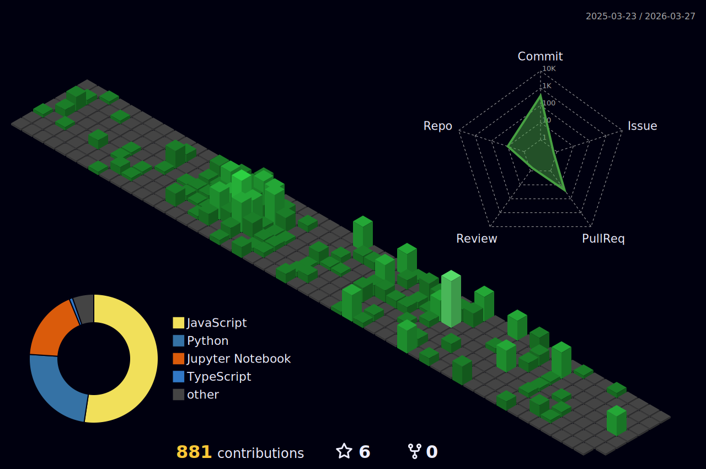

⭐ **0** stars across my repositories

### Hi, I'm Dvir

Mathematical Physics student at the University of Waterloo, graduating December 2026. Previously MLE at Cash App and Research Assistant at Perimeter Institute.  

I work on causal inference, AI/ML, quantum foundations, and behavioral science.

## Projects

**[Causal Modeling for Blood Glucose Control](https://github.com/Blood-Glucose-Control/causal_modeling)**  
Building causal models to understand how insulin timing and dosage affect blood glucose levels using FitBit and Gluroo data. We compared and implemented methods including T4 Framework, Causal Transformers, Counterfactual Recurrent Network with Balanced Representations, and G-Net for counterfactual prediction.

**[Causal Inference Research](https://github.com/dvirzg/causal_inference_public)**  
Research from the Perimeter Institute on causal inference with hidden confounders. Includes DAG unpacking for counterfactual bounds, compatibility testing, inflation methods for constraint derivation, and distribution generation using nonconvex quadratic programming.

**[Forge](https://github.com/dvirzg/Forge)**  
A local macOS media utility with a liquid glass UI. Processes images (AI background removal, format conversion), PDFs (merge, rotate, extract), videos (trim, convert to GIF), and text.

**[Jannote](https://github.com/dvirzg/jannote)**  
My customized fork of Jan (open-source ChatGPT alternative) with custom action functions and a local database for building and mentioning files, prompts, and contexts easily.

**[autocmd](https://github.com/dvirzg/autocmd)**  
Natural language to shell command converter.

---

Learn more: [LinkedIn](https://www.linkedin.com/in/dvirzg) | [dvirzg.com](https://dvirzg.com)